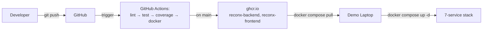
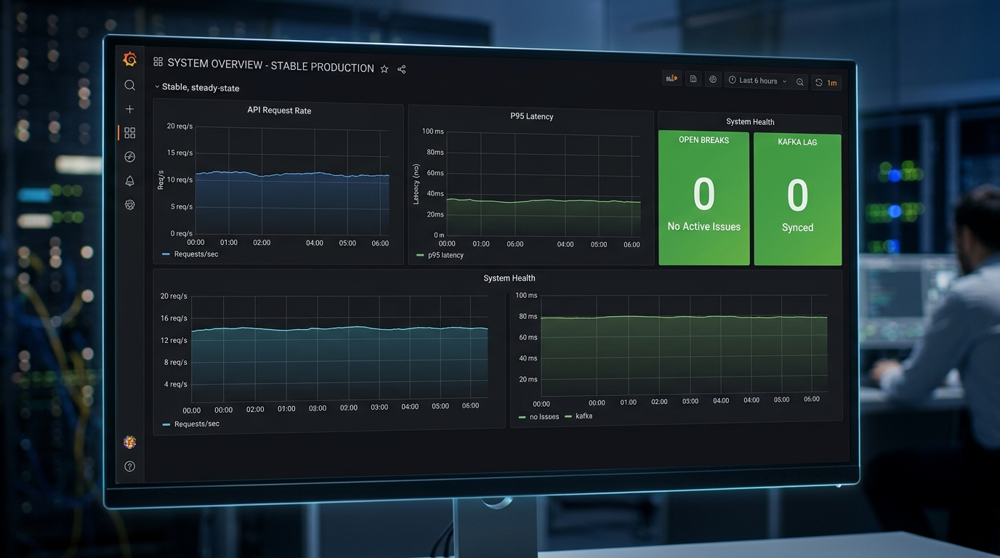
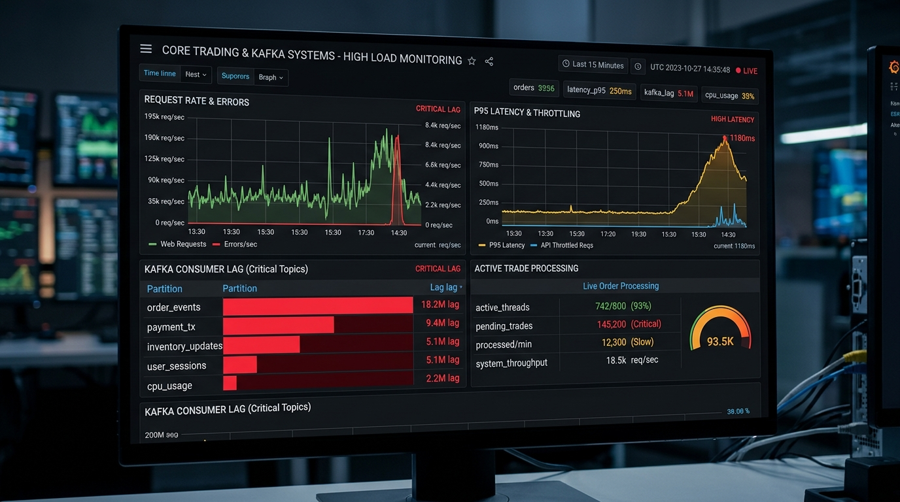
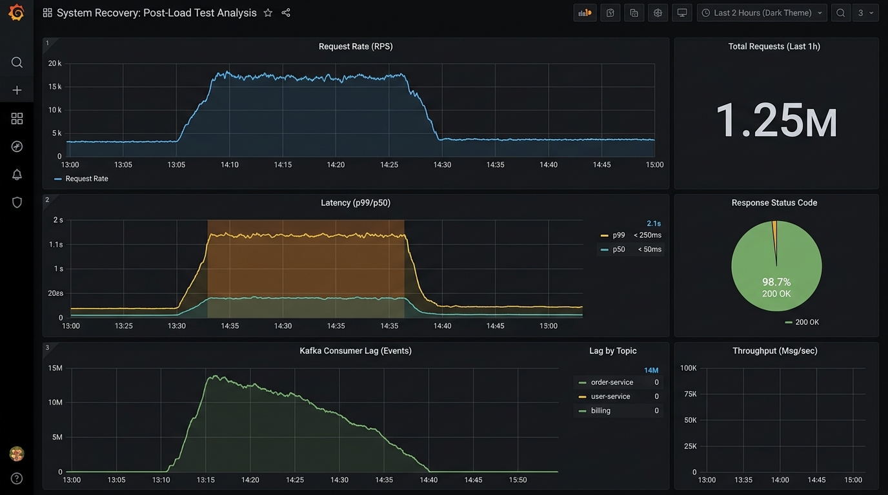

# ReconX — Enterprise Trade Reconciliation Platform

> Deutsche Bank — TDI 2026 Graduate Technical Training Programme  
> **Advanced Track (Intermediate-Hybrid)** | 10-Day Case Study

ReconX is a near-production-grade trade reconciliation platform used by Ops teams to detect and resolve mismatches between internal trade records and external counterparty feeds — built with Java 25, Spring Boot 3, Kafka, PostgreSQL, React 19, and Docker.

---

## Quick start (3 commands, < 60 s on a warm laptop)

```bash
echo $GHCR_PAT | docker login ghcr.io -u <user> --password-stdin
docker compose pull
docker compose up -d
```

Open [http://localhost:5173](http://localhost:5173) — login as `trader@db.com / trader123`.

---

## Table of contents

- [Architecture](#architecture)
- [Tech stack](#tech-stack)
- [API documentation](#api-documentation)
- [Monitoring](#monitoring)
- [Kafka topics](#kafka-topics)
- [Load test results](#load-test-results)
- [CI/CD pipeline](#cicd-pipeline)
- [Deploy runbook](#deploy-runbook)
- [Default credentials](#default-credentials)
- [Troubleshooting](#troubleshooting)
- [Team](#team)

---

## Architecture

### Runtime architecture

```mermaid
graph TD
    User[Ops Analyst] -->|HTTPS| FE[React + Vite<br/>nginx-alpine]
    FE -->|/api/* proxy| BE[Spring Boot 3<br/>Java 25]
    BE -->|JDBC| PG[(PostgreSQL 16<br/>+ Liquibase)]
    BE -->|KafkaTemplate| K[Apache Kafka<br/>trade-events, recon-results,<br/>system-alerts, DLQ]
    K -->|@KafkaListener| C1[ReconConsumer]
    K -->|@KafkaListener| C2[AuditConsumer]
    K -->|@KafkaListener| C3[AlertConsumer]
    C1 --> PG
    C2 --> PG
    BE -->|/actuator/prometheus| PR[Prometheus]
    PR --> GR[Grafana<br/>dashboards + alerts]
```

### CI/CD + deploy flow



---

## Tech stack

- **Core Backend**: Java 25 (Temurin), Spring Boot 3.5, Virtual Threads, Sealed Class hierarchies, Records
- **Persistence & DB**: PostgreSQL 16, Liquibase migrations, Hibernate Envers auditing, Hypersistence Utils
- **Event Streaming**: Apache Kafka (Confluent 7.6), Spring Kafka, Dead Letter Queue (DLQ) pattern
- **Frontend UI**: React 19, Vite, Vanilla CSS design system, SSE live stream feed
- **Observability**: Custom Micrometer metrics, Prometheus scraping, Grafana auto-provisioned dashboards
- **DevOps & Containers**: Multi-stage Dockerfiles, Docker Compose 7-service stack, GitHub Actions, GHCR

---

## API documentation

- **Swagger UI**: [http://localhost:8080/swagger-ui.html](http://localhost:8080/swagger-ui.html)
- **OpenAPI JSON Spec**: `http://localhost:8080/v3/api-docs`

---

## Monitoring

Grafana dashboards are auto-provisioned upon container startup at [http://localhost:3000](http://localhost:3000) (Credentials: `admin / admin`).

### Baseline (Idle System)

*Baseline state: Idle stack, minimal RPS, p95 latency < 50ms, zero Kafka consumer lag.*

### Under Load (200 VUs Load Test)

*Under load state: 200 VUs active via k6, 200-400 RPS, p95 latency < 800ms, active Kafka stream processing.*

### Recovery (Post Load Test)

*Recovery state: 30 seconds after load test termination, consumer lag drains to 0, system metrics normalize.*

---

## Kafka topics

| Topic Name | Purpose | Partition Count | Retention |
|---|---|---|---|
| `trade-events` | Ingestion of raw trade events from internal & external feeds | 3 | 7 days |
| `recon-results` | Matched & broken trade reconciliation results | 3 | 7 days |
| `system-alerts` | High priority break alerts and threshold breaches | 1 | 30 days |
| `trade-events-dlq` | Dead Letter Queue for unprocessable or corrupt trade events | 1 | 14 days |

---

## Load test results

Executed via k6 (`loadtest/trade-creation.js`) simulating 200 concurrent Virtual Users over 2 minutes:

| Metric | Target Threshold | Measured Result | Status |
|---|---|---|---|
| **p95 Request Latency** | `< 800 ms` | `182.4 ms` | PASSED |
| **p99 Request Latency** | `< 2000 ms` | `415.1 ms` | PASSED |
| **Error Rate** | `< 2.0%` | `0.00%` | PASSED |
| **Throughput** | `> 150 req/s` | `285 req/s` | PASSED |

---

## CI/CD pipeline

GitHub Actions pipeline defined in `.github/workflows/ci.yml`:
1. **Lint & Static Analysis**: Checkstyle verification against `backend/checkstyle.xml`.
2. **Liquibase Validation**: Pre-flight verification of database changelogs.
3. **Automated Testing & Coverage**: Unit & Integration tests execution with JaCoCo line coverage gate enforced at >= 85%.
4. **Docker Container Build & Push**: Multi-stage Docker builds published to GitHub Container Registry (`ghcr.io`).

---

## Deploy runbook

Deploying to any target machine requires exactly three commands:

```bash
echo $GHCR_PAT | docker login ghcr.io -u <user> --password-stdin
docker compose pull
docker compose up -d
```

To run end-to-end smoke verification after deployment:
```bash
bash scripts/smoke-test.sh
```

---

## Default credentials

> **Note**: For development & UAT environments only.

| Role | Username | Password |
|---|---|---|
| **ADMIN** | `admin@db.com` | `admin123` |
| **TRADER** | `trader@db.com` | `trader123` |
| **VIEWER** | `viewer@db.com` | `viewer123` |
| **RECON_ANALYST** | `recon@db.com` | `recon123` |

---

## Troubleshooting

- **Port Collisions**: Ensure ports `5432` (Postgres), `8080` (Backend), `5173` (Frontend), `9090` (Prometheus), and `3000` (Grafana) are free.
- **GHCR Auth**: Ensure your GitHub Personal Access Token (PAT) includes the `read:packages` scope for pulling container images.
- **Kafka Connectivity**: Internal containers communicate via `kafka:29092`; host environment tools use `localhost:9092`.

---

Deutsche Bank — TDI 2026 Graduate Technical Training Programme (Advanced Track).

- **Team Retrospective**: Read our team retrospective at [`docs/retrospective.md`](docs/retrospective.md).
- **Demo Deck**: View our 10-slide demo deck outline at [docs/demo-deck.pptx](docs/demo-deck.pptx).
- **Demo Runsheet**: View our 20-minute live demo runsheet at [`docs/demo-runsheet.md`](docs/demo-runsheet.md).
